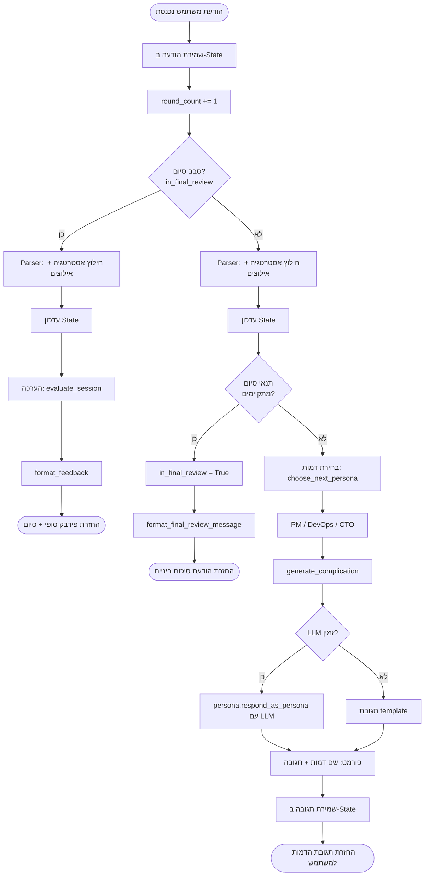
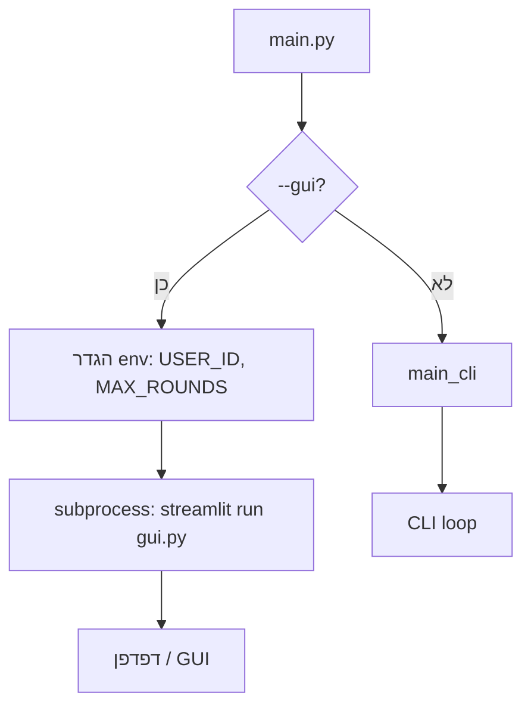
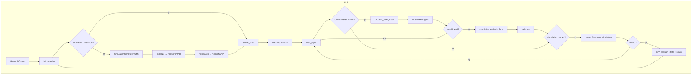
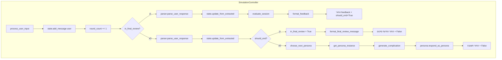
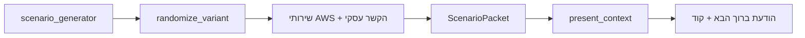
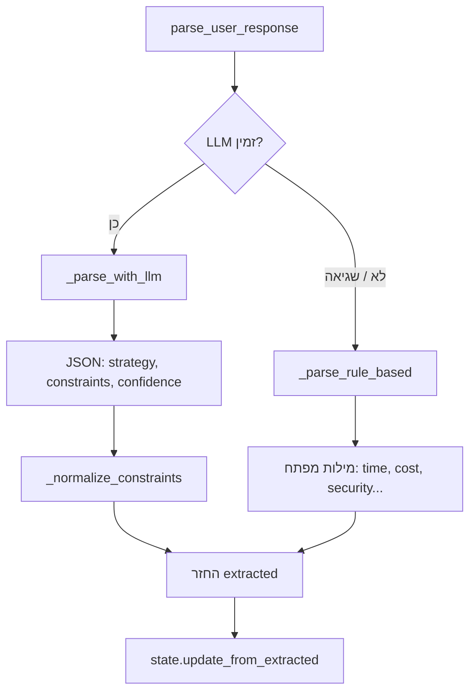
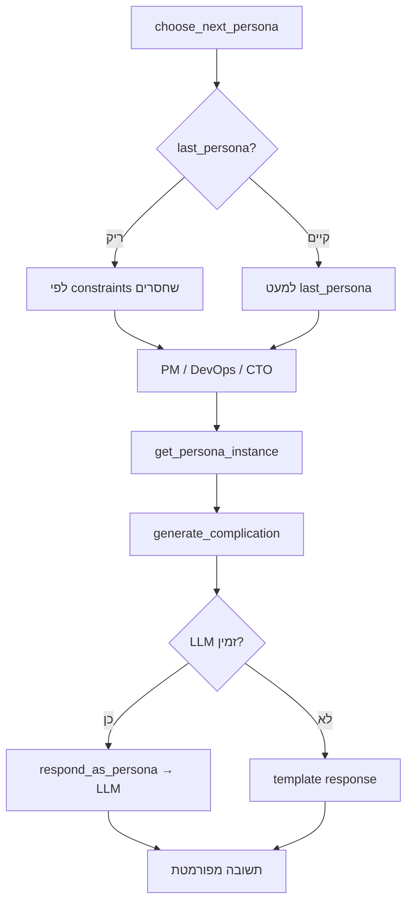
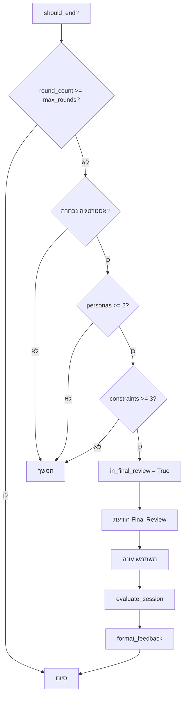

# דיאגרמת זרימה – Cloud Migration Simulation

## זרימת ה-Agent (גרף אחד)

גרף זה מתאר את כל הצעדים שהמערכת (Agent) מבצעת מרגע קבלת הודעה מהמשתמש ועד החזרת תגובה.



**קיצורים:**
- **Parser** = חילוץ strategy, constraints, confidence מההודעה (LLM או rule-based).
- **State** = strategy_selected, constraints_addressed, personas_triggered, round_count וכו'.
- **תנאי סיום** = מספיק סבבים + אסטרטגיה + לפחות 2 דמויות + לפחות 3 אילוצים.

---

## 1. נקודת כניסה (main.py)



## 2. זרימת GUI (gui.py)



## 3. ליבת הסימולציה (process_user_input)



## 4. אתחול סימולציה (initialize)



## 5. פרסור תשובת משתמש (parser)



## 6. בחירת דמות ותגובה (personas)



## 7. תנאי סיום והערכה (state + evaluation)



## 8. מבט על כל המערכת

```mermaid
flowchart TB
    subgraph Entry
        M[main.py]
    end
    subgraph UI
        G[gui.py / Streamlit]
        C[cli.py]
    end
    subgraph Core
        SC[SimulationController]
        ST[State]
    end
    subgraph Data
        SCEN[scenario.py]
        PERS[personas.py]
        PARS[parser.py]
        EVAL[evaluation.py]
    end

    M -->|--gui| G
    M -->|default| C
    G --> SC
    C --> SC
    SC --> ST
    SC --> SCEN
    SC --> PERS
    SC --> PARS
    SC --> EVAL
---

*נוצר עבור Cloud Migration Simulation. ניתן להציג דיאגרמות Mermaid ב־GitHub, VS Code (תוסף Markdown Preview Mermaid), או ב־[mermaid.live](https://mermaid.live).*
