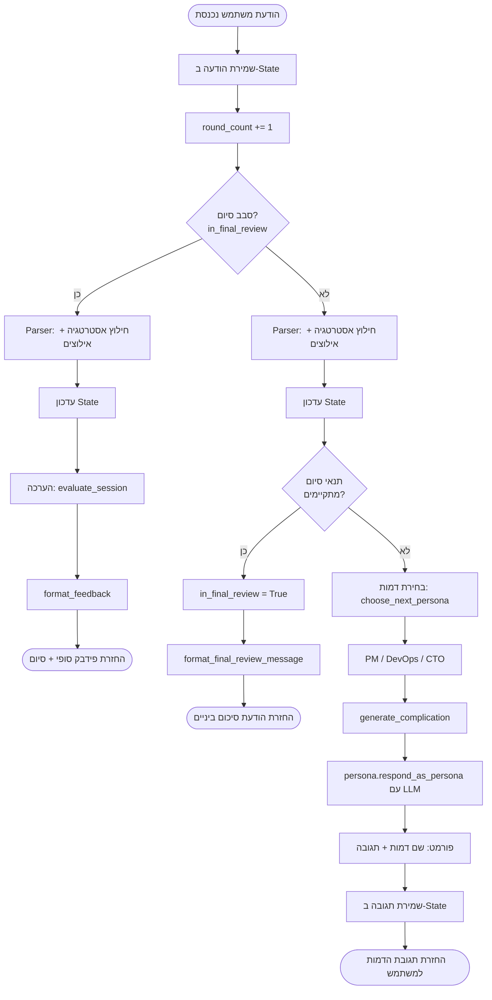
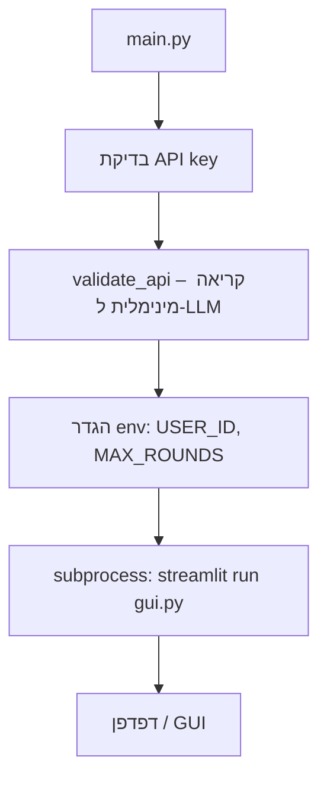
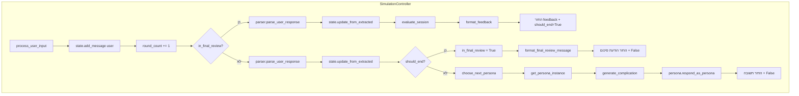
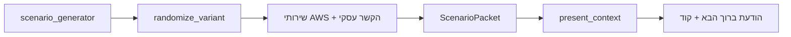
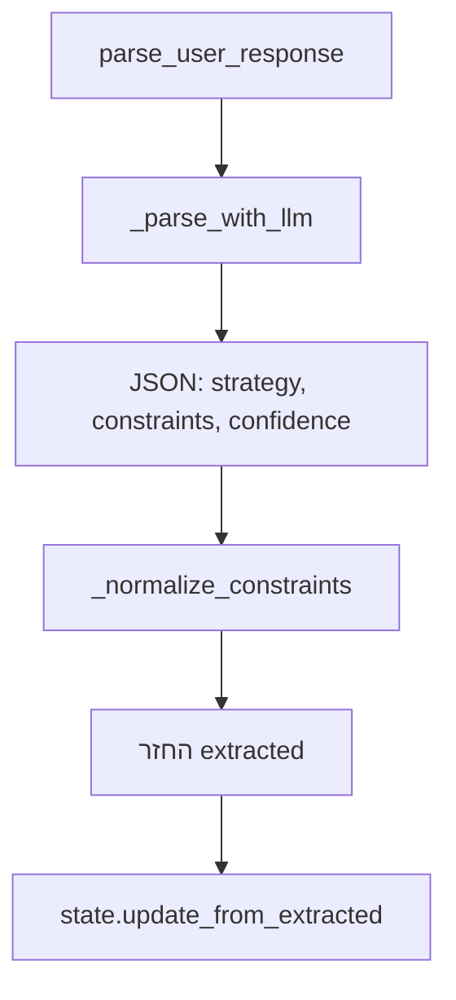
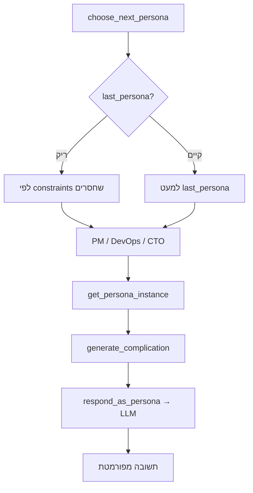
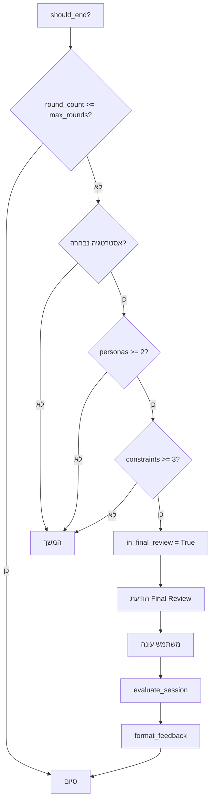
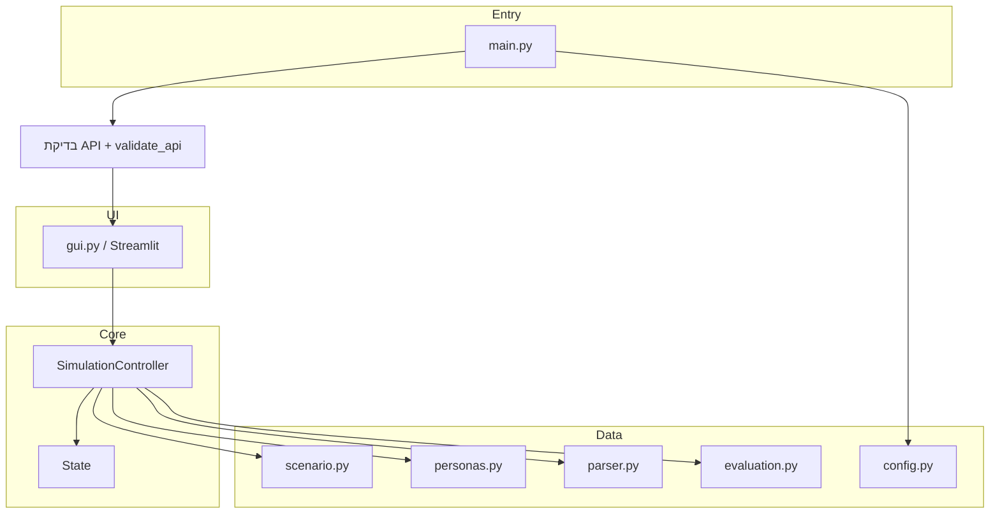

# דיאגרמת זרימה – Cloud Migration Simulation

## זרימת ה-Agent (גרף אחד)

גרף זה מתאר את כל הצעדים שהמערכת (Agent) מבצעת מרגע קבלת הודעה מהמשתמש ועד החזרת תגובה.

**קיצורים:**
- **Parser** = חילוץ strategy, constraints, confidence מההודעה (LLM בלבד).
- **State** = strategy_selected, constraints_addressed, personas_triggered, round_count וכו'.
- **תנאי סיום** = מספיק סבבים + אסטרטגיה + לפחות 2 דמויות + לפחות 3 אילוצים.

---

## 1. נקודת כניסה (main.py)

## 2. זרימת GUI (gui.py)

```mermaid
flowchart TD
    subgraph GUI
        P[Streamlit מופעל] --> Q[init_session]
        Q --> R{simulation ב-session?}
        R -->|לא| S[SimulationController חדש]
        S --> T[initialize → תרחיש ראשוני]
        T --> U[messages ← הודעת הקשר]
        R -->|כן| V[render_chat]
        U --> V
        V --> W[הצג הודעות צ'אט]
        W --> X[chat_input]
        X --> Y{המשתמש שלח הודעה?}
        Y -->|כן| Z[process_user_input]
        Z --> AA[הצג תשובת agent]
        AA --> AB{should_end?}
        AB -->|כן| AC[simulation_ended = True]
        AC --> AD[קבלת ציון מ-get_last_report]
        AD --> AE{ציון 7+?}
        AE -->|כן| AF[balloons + הודעת הצלחה]
        AE -->|לא| AG{ציון 4–6?}
        AG -->|כן| AH[snow + הודעה בינונית]
        AG -->|לא| AI[הודעת כישלון, ללא אנימציה]
        AF --> AJ{simulation_ended?}
        AH --> AJ
        AI --> AJ
        AB -->|לא| X
        AJ -->|כן| AK[הצגת תוצאה + כפתור Start new simulation]
        AK --> AL{לחיצה?}
        AL -->|כן| AM[ריקון session_state + rerun]
        AM --> Q
        AL -->|לא| X
        Y -->|לא| AJ
    end
```

## 3. ליבת הסימולציה (process_user_input)

## 4. אתחול סימולציה (initialize)

## 5. פרסור תשובת משתמש (parser)

(LLM חובה – אין fallback.)

## 6. בחירת דמות ותגובה (personas)

(LLM חובה – אין תגובת template.)

## 7. תנאי סיום והערכה (state + evaluation)

## 8. מבט על כל המערכת

---

*נוצר עבור Cloud Migration Simulation. ניתן להציג דיאגרמות Mermaid ב־GitHub, VS Code (תוסף Markdown Preview Mermaid), או ב־[mermaid.live](https://mermaid.live).*
